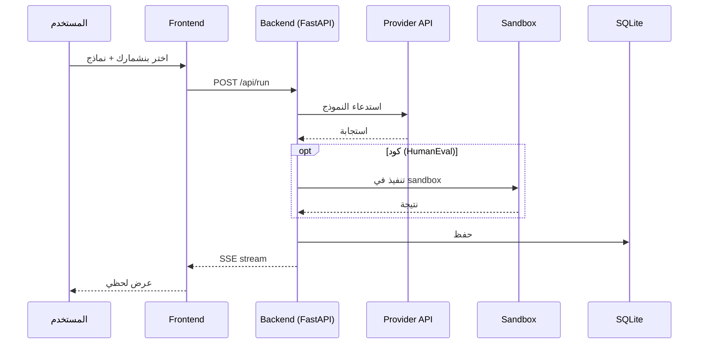

# 🧪 AI Benchmark Platform
### منصة بنشمارك نماذج الذكاء الاصطناعي

<p align="center">
  
  
  
  
  
</p>

> منصة مفتوحة المصدر تشغّلها محلياً لمقارنة نماذج الذكاء الاصطناعي جنباً إلى جنب على بنشماركات حقيقية — بما فيها بنشمارك حصري للأنظمة السعودية والفقه الإسلامي.

<p align="center">
  <i>📸 [أضف لقطة شاشة هنا — مثلاً: <code>screenshots/ui.png</code>]</i>
</p>

---

## 📑 المحتوى

- [نظرة سريعة](#-نظرة-سريعة)
- [المزايا](#-المزايا)
- [التشغيل السريع](#-التشغيل-السريع)
- [إدارة المفاتيح](#-إدارة-المفاتيح)
- [البنشمارك السعودي المخصّص](#-البنشمارك-السعودي-المخصص)
- [البنية التقنية](#-البنية-التقنية)
- [إضافة بنشمارك جديد](#-إضافة-بنشمارك-جديد)
- [الأمان والخصوصية](#-الأمان-والخصوصية)
- [حدود المنصة](#-حدود-المنصة)
- [خريطة الطريق](#-خريطة-الطريق)
- [المساهمة](#-المساهمة)
- [الترخيص](#-الترخيص)

---

## 🎯 نظرة سريعة

قارن **Claude** و **GPT** و **Gemini** والنماذج المحلية (**Ollama**) على نفس المسائل، واحصل على:

- ✅ **الدقة** — نسبة الإجابات الصحيحة لكل بنشمارك
- 💰 **التكلفة** — بالدولار لكل تشغيل
- ⏱️ **زمن الاستجابة** — متوسط وقت الإجابة
- 📊 **تاريخ كامل** — محفوظ في SQLite محلي

الإخراج لحظي عبر Server-Sent Events — تشوف النتائج تتحدّث سؤال بسؤال.

---

## ✨ المزايا

### المزوّدون المدعومون

| المزوّد | النماذج | ملاحظة |
|---------|---------|---------|
| Anthropic | Claude Opus / Sonnet / Haiku | — |
| OpenAI | GPT-4o, GPT-4, GPT-3.5 | — |
| Google | Gemini 1.5 / 2.0 | — |
| Ollama | أي نموذج محلي | مجاني |
| OpenRouter | DeepSeek, Mistral, Qwen, Llama | بوابة موحّدة |

### البنشماركات المتوفّرة

| البنشمارك | الموضوع | نوع التقييم |
|-----------|---------|---------|
| `HumanEval` | برمجة بايثون | تشغيل كود في sandbox |
| `GSM8K` | رياضيات | إجابة رقمية |
| `MMLU` | معرفة عامة | اختيار من متعدّد |
| `ArabicMMLU` | معرفة بالعربية | اختيار من متعدّد |
| **`Saudi Legal & Fiqh`** ⭐ | الأنظمة السعودية + الفقه | اختيار من متعدّد |
| `LLM-as-Judge` | مهام إبداعية | تقييم بنموذج محايد |

### مزايا إضافية

- 📡 **تتبّع لحظي** عبر Server-Sent Events
- 💰 **حساب تكلفة** تلقائي لكل مزوّد ونموذج
- 🔐 **المفاتيح في المتصفح** — تُحفظ في `localStorage`، ما تُخزَّن على الخادم
- 🌐 **واجهة عربية RTL** — Vanilla JS بدون build step
- 💾 **تاريخ الاختبارات** محفوظ في SQLite محلي

---

## 🚀 التشغيل السريع

### المتطلبات

- Python 3.10 أو أحدث
- Git
- (اختياري) [Ollama](https://ollama.ai) لاختبار النماذج المحلية

### التثبيت

```bash
git clone https://github.com/abosalehg-ui/ai-benchmark-platform.git
cd ai-benchmark-platform
```

**على Linux / macOS:**

```bash
python3 -m venv .venv
source .venv/bin/activate
pip install -r requirements.txt
uvicorn backend.main:app --reload --port 8000
```

**على Windows (PowerShell):**

```powershell
python -m venv .venv
.venv\Scripts\Activate.ps1
pip install -r requirements.txt
uvicorn backend.main:app --reload --port 8000
```

افتح المتصفح على **http://localhost:8000** وتوجّه لتبويب **"المفاتيح"** لإضافة مفاتيح API.

---

## 🔑 إدارة المفاتيح

المفاتيح تُحفظ **محلياً فقط** في `localStorage` المتصفح، وتُرسَل في كل طلب كـ header للخادم المحلي الذي بدوره يمرّرها لمزوّد النموذج. **لا يتم تخزينها على الخادم** في أي مرحلة.

1. افتح تبويب **"المفاتيح"** في الواجهة
2. أدخل مفاتيح المزوّدين اللي تبي تختبرهم
3. اضغط **"حفظ"**

> ⚠️ **لا تنشر السيرفر على الإنترنت العام.** المنصّة مصمّمة للاستخدام المحلي فقط. إذا نشرته بدون authentication، أي شخص يوصله يقدر يستخدم مفاتيحك.

---

## 🇸🇦 البنشمارك السعودي المخصّص

بنشمارك حصري لاختبار فهم النماذج للقانون السعودي والفقه الإسلامي — **30 سؤال** موثّق تغطّي:

| المجال | الأمثلة |
|---------|---------|
| نظام العمل | ساعات العمل، مكافأة نهاية الخدمة، الإجازات، الفصل |
| نظام الإيجار | منصّة إيجار، التوثيق |
| نظام التنفيذ | أوامر التنفيذ، الحجز، الإفصاح |
| الجرائم المعلوماتية | التشهير، الاحتيال الإلكتروني |
| نظام الشركات | ذ.م.م، المؤسسة الفردية |
| المرافعات | الاختصاص، منصّة ناجز، مدد الاستئناف |
| الفقه الإسلامي | عبادات، معاملات، أحوال شخصية، مواريث |
| النظام الجزائي | حق الاستعانة بمحامٍ، التوقيف |

كل سؤال يأتي مع: **الإجابة الصحيحة** + **شرح** + **المصدر النظامي أو الشرعي**.

---

## 🏗️ البنية التقنية

```
ai-benchmark-platform/
├── backend/
│   ├── providers/          # واجهة موحّدة لكل المزوّدين
│   │   ├── base.py
│   │   ├── claude.py
│   │   ├── openai.py
│   │   ├── gemini.py
│   │   ├── ollama.py
│   │   └── openrouter.py
│   ├── benchmarks/         # تعريف البنشماركات
│   │   ├── base.py
│   │   ├── humaneval.py
│   │   ├── gsm8k.py
│   │   ├── mmlu.py
│   │   ├── arabic_mmlu.py
│   │   ├── saudi_legal.py  # ⭐ مخصّص
│   │   └── llm_judge.py
│   ├── datasets/           # بيانات الاختبار (JSON)
│   ├── sandbox.py          # تشغيل الكود بأمان
│   ├── pricing.py          # أسعار المزوّدين
│   ├── runner.py           # محرّك التشغيل + SSE
│   ├── db.py               # SQLite
│   └── main.py             # FastAPI
├── frontend/
│   ├── index.html
│   ├── app.js
│   └── styles.css
├── tests/
├── .env.example
├── LICENSE
└── requirements.txt
```

### تدفّق الطلب



---

## 🧩 إضافة بنشمارك جديد

**1.** أنشئ ملف `backend/benchmarks/my_benchmark.py`:

```python
from backend.benchmarks.base import BaseBenchmark, Problem, Score

class MyBenchmark(BaseBenchmark):
    name = "my_benchmark"
    display_name = "بنشماركي"
    dataset_file = "my_data.json"

    def _parse_problem(self, raw):
        return Problem(id=raw["id"], prompt=raw["q"], reference=raw["a"])

    def build_prompt(self, problem):
        return problem.prompt

    async def evaluate(self, problem, response, judge_provider=None):
        correct = response.text.strip() == problem.reference
        return Score(
            problem_id=problem.id,
            correct=correct,
            raw_score=1.0 if correct else 0.0,
            model_response=response.text,
        )
```

**2.** أضف داتاست في `backend/datasets/my_data.json`

**3.** سجّله في `backend/benchmarks/__init__.py`

---

## 🔒 الأمان والخصوصية

### Sandbox الكود
بنشمارك `HumanEval` ينفّذ كود مولَّد من النموذج. للحماية:
- `subprocess` بـ `timeout=10s`
- قائمة سوداء للاستيرادات: `os.system`, `subprocess`, `socket`, `urllib`, ...
- قابل للتعطيل في الإعدادات (للمطوّرين الذين يشغّلون محلياً ويثقون بالنماذج)

### المفاتيح
- محفوظة في `localStorage` المتصفح
- تُرسَل لسيرفرك المحلي في كل طلب كـ header
- الخادم يمرّرها لمزوّد النموذج بدون تخزين
- **ما في طرف ثالث** يوصل لها

### الخصوصية
- **صفر** analytics أو tracking
- كل البيانات محلية على جهازك (SQLite + localStorage)
- كود مفتوح المصدر — راجع بنفسك

---

## ⚠️ حدود المنصة

- **مصمّمة للاستخدام المحلي** — ليست للنشر على السيرفرات العامة بدون auth
- **Sandbox بسيط** — ما يحمي من هجمات متقدمة؛ للإنتاج استخدم Docker أو gVisor
- **البنشمارك السعودي 30 سؤال فقط** — نطاق تجريبي، محتاج توسيع
- **لا يوجد web UI عام** لمقارنة النماذج — كل واحد يشغّلها محلياً

---

## 🗺️ خريطة الطريق

- [ ] توسيع البنشمارك السعودي إلى 200+ سؤال
- [ ] دعم Cohere و Groq
- [ ] Docker Compose للنشر الذاتي
- [ ] تصدير النتائج كـ PDF / CSV
- [ ] دمج RAG في التقييم
- [ ] بنشمارك للّهجات العربية (خليجي، مصري، مغربي)

---

## 🤝 المساهمة

المشروع مفتوح للمساهمات. الأولويات:

- **توسيع البنشمارك السعودي** بأسئلة موثّقة من نصوص الأنظمة والفتاوى المعتمدة
- **بنشماركات عربية إضافية** (لغة، أدب، تاريخ إسلامي)
- **دعم مزوّدين جدد**
- **تحسينات الواجهة** (dark mode، responsive للجوال)

افتح Issue أو Pull Request 👋

---

## 📜 الترخيص

[MIT](LICENSE) — حر للاستخدام الشخصي والتجاري.

---

## 👤 المطوّر

**عبدالكريم** — [@abosalehg-ui](https://github.com/abosalehg-ui)

<p align="center">
  <sub>صُنع بـ ❤️ من المدينة المنوّرة</sub>
</p>
