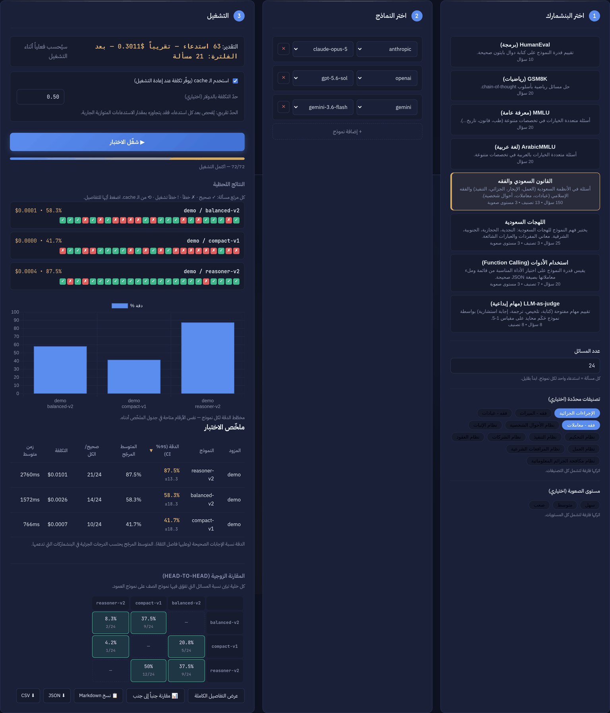
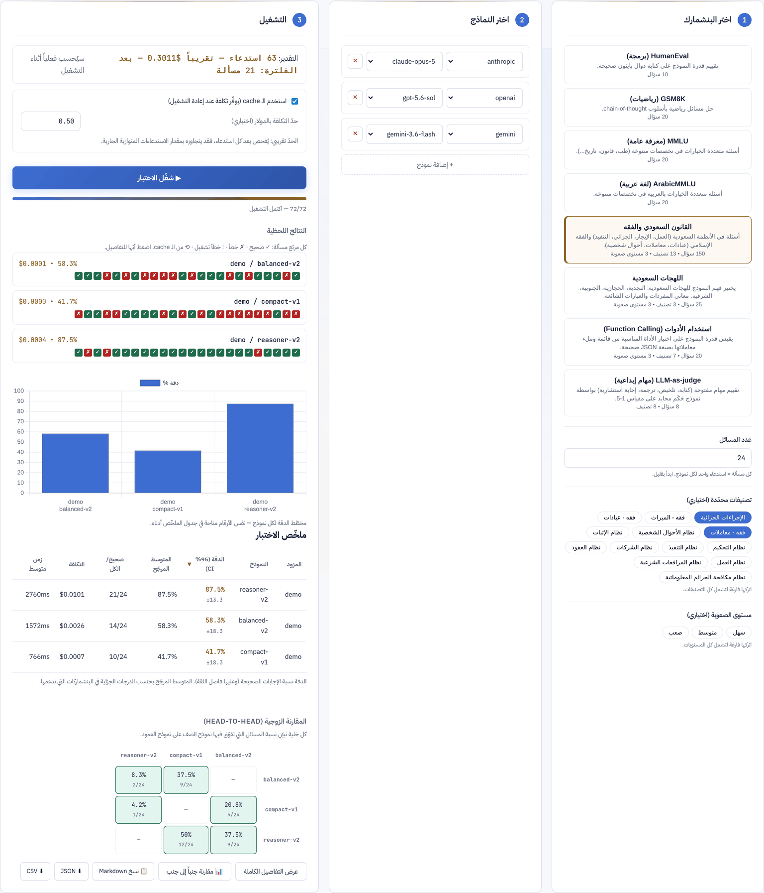
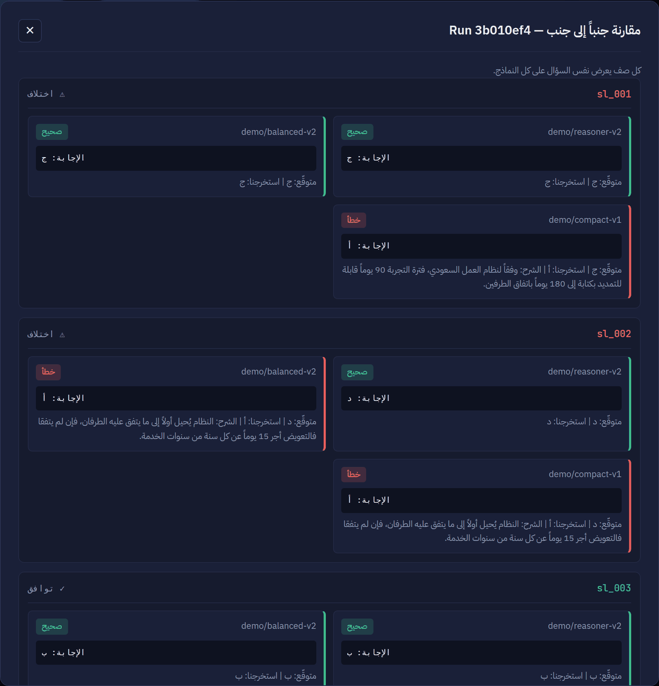
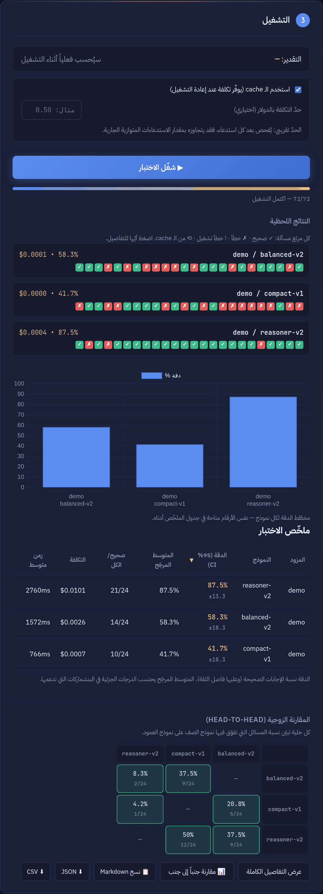
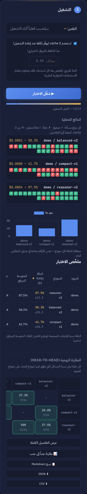
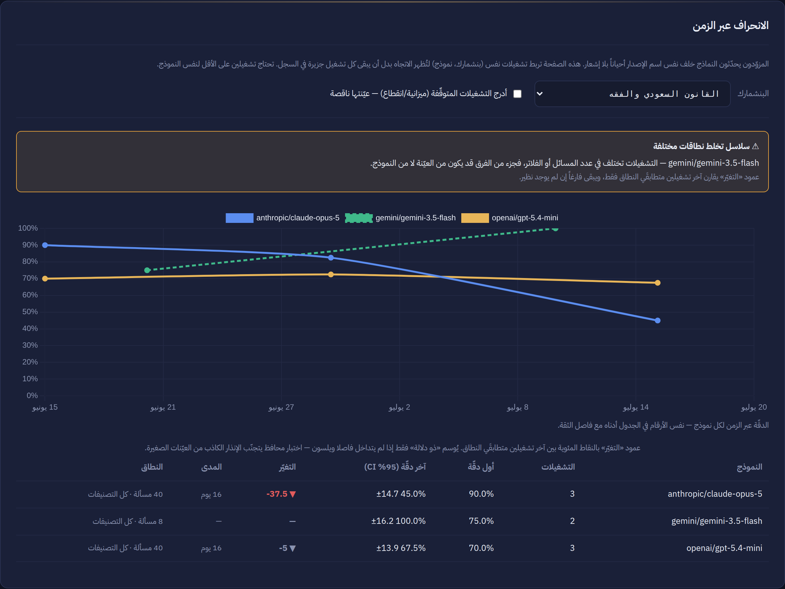
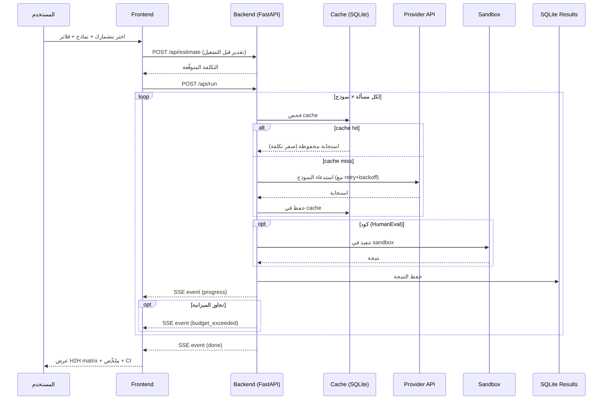

# 🧪 AI Benchmark Platform
### منصة بنشمارك نماذج الذكاء الاصطناعي

<p align="center">
  
  
  
  
  
  
</p>

> منصة مفتوحة المصدر لمقارنة نماذج الذكاء الاصطناعي جنباً إلى جنب على بنشماركات حقيقية — تجمع بين **8 بنشماركات** (314 سؤالاً) و **9 مزوّدين** (38 نموذجاً + اكتشاف تلقائي لنماذج Ollama)، مع تركيز خاص على **اللغة العربية** و **الأنظمة السعودية والفقه الإسلامي**.

<p align="center">
  
  <br>
  <sub><i>الواجهة الرئيسية — من اختيار البنشمارك إلى النتائج اللحظية وفاصل الثقة والمقارنة الزوجية</i></sub>
</p>

<table align="center">
  <tr>
    <td width="50%" align="center">
      
      <br><sub><i>المظهر الفاتح — كل أزواج الألوان تتجاوز WCAG AA</i></sub>
    </td>
    <td width="50%" align="center">
      
      <br><sub><i>المقارنة جنباً إلى جنب — نفس السؤال على كل النماذج</i></sub>
    </td>
  </tr>
  <tr>
    <td align="center">
      
      <br><sub><i>لوحة النتائج — النقاط اللحظية والمخطّط والملخّص</i></sub>
    </td>
    <td align="center">
      
      <br><sub><i>الجوال — 390px بلا تمرير أفقي</i></sub>
    </td>
  </tr>
</table>

<p align="center">
  <sub>
    🔎 <b>عن الأرقام في اللقطات:</b> هي نتائج تشغيل <b>فعلي</b> عبر محرّك المنصّة على 24 سؤالاً من
    بنشمارك القانون السعودي، لكن بمزوّد <b>تجريبي محلي</b> (<code>demo/*</code>) لا بنماذج حقيقية —
    فلا تُقرأ كنتائج بنشمارك لأي منتج.
  </sub>
</p>

<p align="center">
  <b>8</b> بنشماركات &nbsp;•&nbsp; <b>9</b> مزوّدين &nbsp;•&nbsp; <b>38</b> نموذجاً &nbsp;•&nbsp; <b>314</b> سؤال &nbsp;•&nbsp; <b>216</b> سؤال سعودي
</p>

---

## 📑 المحتوى

- [نظرة سريعة](#-نظرة-سريعة)
- [المزايا الرئيسية](#-المزايا-الرئيسية)
- [التشغيل السريع](#-التشغيل-السريع)
- [إدارة المفاتيح](#-إدارة-المفاتيح)
- [البنشمارك السعودي المخصّص](#-البنشمارك-السعودي-المخصص)
- [صحّة القياس: خطّ أساس التخمين](#-صحّة-القياس-خطّ-أساس-التخمين)
- [Sandbox تشغيل الكود](#%EF%B8%8F-sandbox-تشغيل-الكود)
- [البنية التقنية](#%EF%B8%8F-البنية-التقنية)
- [مرجع الـ API](#-مرجع-الـ-api)
- [متغيّرات البيئة](#%EF%B8%8F-متغيّرات-البيئة)
- [إضافة بنشمارك جديد](#-إضافة-بنشمارك-جديد)
- [الأمان والخصوصية](#-الأمان-والخصوصية)
- [حدود المنصة](#%EF%B8%8F-حدود-المنصة)
- [خريطة الطريق](#%EF%B8%8F-خريطة-الطريق)
- [المساهمة](#-المساهمة)
- [الترخيص](#-الترخيص)

---

## 🎯 نظرة سريعة

قارن نماذج كبار مزوّدي الذكاء الاصطناعي (**Claude**، **GPT**، **Gemini**، **Grok**، **Mistral**، **Cohere**، **Llama عبر Groq**) والنماذج المحلية (**Ollama**) جنباً إلى جنب على نفس المسائل، واحصل لحظياً على:

- ✅ **الدقة** مع **فاصل ثقة 95%** (Wilson)
- 💰 **التكلفة الفعلية + تقدير مسبق** بالدولار
- ⏱️ **زمن الاستجابة** (متوسط ولكل سؤال)
- 🔀 **مصفوفة Head-to-Head** للمقارنة الزوجية
- 📊 **عرض جنباً إلى جنب** (Diff view) للإجابات
- 📜 **تاريخ كامل** محفوظ في SQLite محلي

الإخراج لحظي عبر Server-Sent Events — تشاهد النتائج تتحدّث سؤال بسؤال.

---

## ✨ المزايا الرئيسية

### 🤖 المزوّدون المدعومون (9)

| المزوّد | عدد النماذج | أمثلة | ملاحظة |
|---------|:---:|---------|---------|
| **Anthropic** | 4 | Claude Opus 4.7، Sonnet 4.6، Haiku 4.5 | — |
| **OpenAI** | 5 | GPT-4o، GPT-4-Turbo، o1-preview | — |
| **Google** | 3 | Gemini 1.5 Pro/Flash، Gemini 2.0 Flash | — |
| **Groq** | 5 | Llama 3.3 70B، Mixtral، Gemma 2، DeepSeek-R1-Distill | استنتاج فائق السرعة |
| **Mistral** | 5 | Large، Small، Codestral، Nemo، Ministral | API مباشر |
| **Cohere** | 4 | Command R+ / R / R7B | متعدد اللغات قوي |
| **xAI** | 3 | Grok 2 / Grok 2 Mini / Grok Beta | — |
| **Ollama** | ديناميكي | أي نموذج محلي (Llama، Qwen، Mistral…) | مجاني — يكتشف النماذج المثبّتة تلقائياً |
| **OpenRouter** | 4 | DeepSeek، Mistral، Qwen، Llama | بوابة موحّدة لمئات النماذج |

### 📚 البنشماركات المتوفّرة (8)

| البنشمارك | الموضوع | نوع التقييم | الأسئلة |
|-----------|---------|-------------|:---:|
| `HumanEval` | برمجة بايثون | تشغيل كود في sandbox | 10 |
| `GSM8K` | رياضيات | إجابة رقمية | 20 |
| `MMLU` | معرفة عامة (إنجليزي) | اختيار من متعدّد | 20 |
| `ArabicMMLU` | معرفة بالعربية | اختيار من متعدّد | 20 |
| ⭐ **`Saudi Legal & Fiqh`** | الأنظمة السعودية + الفقه (13 تصنيف) | اختيار من متعدّد مع شرح ومصدر | **150** |
| ⭐ **`Saudi Dialects`** | اللهجات السعودية (نجدية/حجازية/جنوبية/شرقية — متوازنة عدداً وموضع إجابة) | اختيار من متعدّد | 66 |
| ⭐ **`Tool Use`** | اختيار الأداة وتعبئة معاملاتها JSON | استخراج JSON + مطابقة الأرغومنتات | 20 |
| `LLM-as-Judge` | مهام إبداعية | تقييم بنموذج محايد | 8 |

كل البنشماركات تدعم **فلتر التصنيفات** و **مستوى الصعوبة** (سهل / متوسط / صعب) حيث ينطبق.

### 💎 ميزات إضافية

#### 💰 التحكم بالتكلفة والأداء
- **تقدير التكلفة المسبق** قبل التشغيل (مبني على طول الـ prompts الفعلية × الأسعار)
- **حدّ تكلفة (Budget cap)** يوقف التشغيل تلقائياً عند تجاوز الميزانية
- **Cache للاستجابات** في SQLite (نفس السؤال = صفر تكلفة + صفر latency)
- **Retry + backoff** تلقائي مع `Retry-After` لكل أخطاء الشبكة العابرة

#### 📊 التحليل والمقارنة
- **مصفوفة Head-to-Head**: لكل زوج (A, B) نسبة المسائل التي تفوّق فيها A وحده على B
- **Diff view**: عرض إجابات النماذج على نفس السؤال جنباً إلى جنب
- **فواصل ثقة 95% (Wilson)** على الدقة — يخبرك متى عيّنتك صغيرة جداً
- **جدول ملخّص قابل للترتيب** بأي عمود (دقة، تكلفة، latency، …)
- **النقر على نقطة الحالة** يفتح تفاصيل تلك المسألة فوراً
- **تتبّع الانحراف عبر الزمن (drift tracking)** — يربط تشغيلات نفس (بنشمارك، نموذج)
  ليُظهر الاتجاه بدل أن يبقى كل تشغيل جزيرة في السجل

#### 📤 التصدير والمشاركة
- تصدير **JSON / CSV** (بـ BOM لاستيراد Excel)
- **نسخ كـ Markdown** بنقرة (مناسب للـ PR descriptions، التقارير، المدوّنات)

#### 🎨 تجربة المستخدم
- **مظهر داكن / فاتح** قابل للتبديل
- **واجهة عربية RTL** بـ Vanilla JS بدون build step
- **Responsive للجوال** (breakpoints عند 720px و 480px)
- **📡 تتبّع لحظي** عبر Server-Sent Events
- **Tooltips** على كل نقطة حالة تعرض ID المسألة + latency

#### 🔐 الخصوصية والأمان
- **المفاتيح في المتصفح** (`localStorage`) — لا تُخزَّن على الخادم
- **Sandbox قابل للاختيار** (subprocess محلي أو Docker معزول للنشر)
- **CORS مقيّد** افتراضياً للـ localhost (قابل للتخصيص عبر env)
- **صفر analytics أو tracking** — كل الأصول مستضافة محلياً، بلا CDN

---

## 🚀 التشغيل السريع

### المتطلبات
- **Python 3.10+** (مُختبَر على 3.10، 3.11، 3.12)
- **Git**
- *(اختياري)* [Ollama](https://ollama.ai) لاختبار النماذج المحلية
- *(اختياري)* **Docker** لتفعيل الـ sandbox المعزول (للنشر)

### التثبيت

```bash
git clone https://github.com/abosalehg-ui/ai-benchmark-platform.git
cd ai-benchmark-platform
```

**Linux / macOS:**

```bash
python3 -m venv .venv
source .venv/bin/activate
pip install -r requirements.txt
uvicorn backend.main:app --reload --port 8000
```

**Windows (PowerShell):**

```powershell
python -m venv .venv
.venv\Scripts\Activate.ps1
pip install -r requirements.txt
uvicorn backend.main:app --reload --port 8000
```

**مع Sandbox معزول (للنشر):**

```bash
SANDBOX_BACKEND=docker uvicorn backend.main:app --port 8000
```

افتح **http://localhost:8000** وتوجّه لتبويب **"المفاتيح"** لإضافة مفاتيح API.

---

## 🔑 إدارة المفاتيح

المفاتيح تُحفظ **محلياً فقط** في `localStorage` المتصفح، وتُرسَل ضمن جسم طلب `/api/run` للخادم المحلي الذي بدوره يمرّرها لمزوّد النموذج. **لا تُخزَّن على الخادم** في أي مرحلة.

1. افتح تبويب **"المفاتيح"**
2. أدخل مفاتيح المزوّدين اللي تبي تختبرهم (8 حقول لـ Anthropic، OpenAI، Gemini، Groq، Mistral، Cohere، xAI، OpenRouter + Ollama URL)
3. اضغط **"حفظ"** — تبقى في متصفحك فقط

> ⚠️ **للنشر على الإنترنت العام**: اضبط `API_TOKEN` (بدونه تُرفض الطلبات من خارج الجهاز)، تأكّد أن `/api/sandbox/status` يُرجع `is_isolated: true`، وقيّد `ALLOWED_ORIGINS`.

---

## 🇸🇦 البنشمارك السعودي المخصّص

بنشمارك حصري لاختبار فهم النماذج للقانون السعودي والفقه الإسلامي — **150 سؤال** موثّق موزّع على **13 تصنيف** (كل تصنيف ≥ 10 أسئلة) و **3 مستويات صعوبة** (سهل / متوسط / صعب):

| المجال | عدد الأسئلة | أمثلة |
|---------|:---:|---------|
| نظام العمل | 10 | فترة التجربة، مكافأة نهاية الخدمة، الإجازات، الأجر الإضافي |
| الإجراءات الجزائية | 10 | التوقيف، حقوق المتهم، الاستئناف، التفتيش، حق الصمت |
| نظام التنفيذ | 12 | أوامر التنفيذ، الإفصاح، الحجز التحفظي، توزيع الحصيلة |
| نظام الأحوال الشخصية | 10 | الزواج، الطلاق، الخلع، النفقة، ولاية الزواج |
| نظام مكافحة الجرائم المعلوماتية | 12 | التشهير، الاحتيال، اختراق، البرامج الضارة، الشروع |
| نظام المرافعات الشرعية | 12 | الاختصاص، اليمين، التبليغ، المعارضة، التماس إعادة النظر |
| نظام العقود (المعاملات المدنية) | 12 | عيوب الإرادة، الشرط الجزائي، الظروف الطارئة، حسن النية |
| نظام التحكيم | 12 | الاتفاق، البطلان، تنفيذ الحكم الأجنبي، تصحيح الحكم |
| نظام الإثبات | 12 | الكتابة، الشهادة، الإقرار القضائي، اليمين المتممة، القرائن |
| نظام الشركات | 12 | الاندماج، التصفية، توزيع الأرباح، الشركة البسيطة |
| فقه - عبادات | 11 | الصلاة، الزكاة، الصيام، المسح على الخفين |
| فقه - معاملات | 11 | الربا، التقسيط، المضاربة، الرهن، الإجارة المنتهية بالتمليك |
| فقه - الميراث | 14 | الفرائض، العَوْل، الرَّدّ، العمريتان، الأكدرية، ميراث الجد |

كل سؤال يأتي مع: **الإجابة الصحيحة** + **شرح** + **المصدر النظامي أو الشرعي** (رقم مادة / آية / حديث / قرار مجمع فقهي) + **مستوى صعوبة**.

تغطية الأنظمة الحديثة:
- **نظام المعاملات المدنية** (م/191 لسنة 1444هـ)
- **نظام الإثبات** (م/43 لسنة 1443هـ)
- **نظام الشركات الجديد** (م/132 لسنة 1443هـ)
- **نظام الأحوال الشخصية** (1443هـ)

---

## 📏 صحّة القياس: خطّ أساس التخمين

بنشمارك لا يفرّق بين نموذج يفهم ونموذج يخمّن ليس بنشماركاً. مراجعة 2026-09 وجدت
أن **130 من 150** إجابة في `saudi_legal.json` كانت على الحرف «ب»: نموذج يجيب «ب»
بلا قراءة السؤال يحصل على **86.7%**.

**ما عولج:** خلط حتمي لترتيب الخيارات ببذرة مشتقّة من (البنشمارك، معرّف
المسألة) — حتمي لا عشوائي لأن الترتيب جزء من الـ prompt ومن مفتاح الـ cache ومن
معنى «نفس التشغيل» في تتبّع الانحراف. انحياز الحرف نزل إلى **28.7%**، ويمنع
`tests/test_dataset_validity.py` عودته.

**ما لا يعالجه الخلط:** انحياز **الصياغة**. في نفس الملف يبقى الخيار الصحيح هو
الأطول في **94.7%** من الأسئلة، لأن كاتب السؤال يشرح الإجابة الصحيحة ويكتفي في
المشتّتات بعبارة قصيرة. إصلاح ذلك يحتاج مختصّاً يعيد كتابة المشتّتات، لا كوداً.

**فما الذي يفعله الكود؟ لا يخفي الرقم.** كل تشغيل اختيار من متعدّد يحسب خطّ
أساس التخمين على **مسائله هو** (بعد الفلترة والقصّ) ويعرضه فوق جدول الملخّص:

```
📏 خطّ أساس التخمين على هذه العيّنة: «دائماً ج» = 28.7% · «أطول خيار» = 94.7%
```

فحين ترى «91% دقّة» تعرف فوراً أنها **دون** خطّ أساس أطول خيار، وأن الرقم لا
يقول شيئاً عن فهم النموذج للأنظمة السعودية. الرقم المعروض بلا خطّ أساس هو الذي
يضلّل، لا الرقم المنخفض.

---

## 🛡️ Sandbox تشغيل الكود

بنشمارك `HumanEval` ينفّذ كوداً مولَّداً من النموذج. المنصّة توفّر **backends متعدّدة قابلة للاختيار**:

| Backend | الأمان | المتطلبات | للاستخدام |
|---------|:---:|---|---|
| `auto` *(افتراضي)* | حسب المتاح | يفضّل Docker، يقع على subprocess | الافتراضي المعقول |
| `docker` | 🛡️ عالٍ (عزل كامل) | Docker daemon شغّال | النشر / الإنتاج |
| `subprocess` | 🔓 **بلا عزل** | لا شيء | آخر خيار فقط |

> ⚠️ **مسار `subprocess` ليس sandbox.** حمايته الوحيدة قائمة سوداء من أنماط
> regex، وهي **لا تحظر `open()`** فقراءة `~/.ssh` أو `~/.aws/credentials` تمرّ
> منها، ولا تمنع `importlib.import_module('socket')` ولا وحدات شبكة غير مذكورة
> مثل `ftplib`. حدود `resource.setrlimit` تحمي من استنزاف الموارد لا من قراءة
> الملفات. الكود المُنفَّذ يأتي من نموذج خارجي — إن لم يكن لديك Docker، شغّل
> `HumanEval` فقط على جهاز تقبل أن يقرأ ملفاته كودٌ لا تثق به.
>
> المنصّة تعرض تحذيراً في الواجهة قبل بدء أي تشغيل يُنفّذ كوداً بلا عزل.

**التحكّم عبر env:**

```bash
SANDBOX_BACKEND=docker uvicorn backend.main:app --port 8000
```

**خصائص Docker backend** (كل تشغيل = container مؤقت معزول):
- `--network=none` — لا اتصال خارجي
- `--memory=256m --cpus=0.5 --pids-limit=64` — حدود موارد
- `--read-only` + `--tmpfs=/tmp:size=64m` — نظام ملفات للقراءة
- `--user=65534:65534` (nobody) — غير root
- `--security-opt=no-new-privileges`
- `--rm` + container name + `docker kill` على timeout
- صورة افتراضية: `python:3.11-slim` (تتغير بـ `SANDBOX_DOCKER_IMAGE`)

تبويب "المفاتيح" يعرض حالة الـ backend الحالي وما إذا كان معزولاً.

---

## 📉 تتبّع الانحراف عبر الزمن

المزوّدون يحدّثون النماذج خلف نفس اسم الإصدار أحياناً بلا إشعار، فدقّة
`claude-opus-5` اليوم قد تختلف عنها بعد شهر على نفس البنشمارك. تبويب **الانحراف**
يربط تشغيلات نفس (بنشمارك، نموذج) ويرسم اتجاه الدقّة، مع جدول يذكر التغيّر
بالنقاط المئوية والمدى الزمني.

<p align="center">
  
</p>

**المزلق الذي تتجنّبه الميزة عمداً:** مقارنة تشغيل من 10 مسائل بتشغيل من 200 — أو
تشغيل مفلتَر على «نظام العمل» بتشغيل بلا فلاتر — ثم تسمية الفرق «انحرافاً». الفرق
هنا من اختلاف العيّنة لا من تغيّر النموذج. لذلك:

| الآلية | ما تمنعه |
|---|---|
| كل نقطة تحمل **بصمة نطاق** (عدد المسائل + التصنيفات + الصعوبات) | خلط عيّنات غير متكافئة بلا علم المستخدم |
| عمود «التغيّر» يقارن **آخر تشغيلين متطابقَي النطاق فقط** | نسبة تقفز من 75% إلى 100% لمجرّد أن التشغيل الأخير كان 8 مسائل |
| لافتة تحذير + خطّ متقطّع للسلاسل مختلطة النطاق | ثقة زائدة في خطّ يصل نقاطاً غير قابلة للمقارنة |
| التشغيلات المتوقّفة (ميزانية/انقطاع) مستبعَدة افتراضياً — أمّا `completed_with_errors` فمُدرَجة | هبوط وهمي من عيّنة ناقصة، بلا معاقبة نماذج سليمة بسبب تعثّر نموذج واحد |
| «ذو دلالة» فقط عند **عدم تداخل فاصلَي ويلسون** | إنذار كاذب من عيّنة صغيرة يدفع لتغيير نموذج بلا سبب |

الاختبار الأخير محافظ عمداً: 3/5 ← 2/5 فرق 20 نقطة مئوية لكنه تقلّب عيّنة، فلا
يُوسم انحرافاً. بينما 190/200 ← 100/200 يُوسم.

> ⚠️ **حدّ يخصّ التشغيلات القديمة:** ترتيب خيارات الاختيار من متعدّد صار
> مخلوطاً خلطاً حتمياً (انظر «صحّة القياس» أدناه)، والترتيب جزء من الـ prompt.
> تشغيلات ما قبل ذلك التغيير تُقارَن بتشغيلات ما بعده على نفس البنشمارك، وقد
> يعكس الفرق تصحيحَ تحيّز في الداتاست لا تغيّراً في النموذج.

---

## 🏗️ البنية التقنية

```
ai-benchmark-platform/
├── backend/
│   ├── providers/              # 9 مزوّدين + helper مشترك للـ retry
│   │   ├── base.py             # ModelResponse + estimate_tokens_from_text
│   │   ├── _http.py            # post_with_retry (backoff + Retry-After)
│   │   ├── claude.py
│   │   ├── openai.py
│   │   ├── gemini.py
│   │   ├── groq.py             # ⭐ جديد
│   │   ├── mistral.py          # ⭐ جديد
│   │   ├── cohere.py           # ⭐ جديد
│   │   ├── xai.py              # ⭐ جديد
│   │   ├── ollama.py
│   │   └── openrouter.py
│   ├── benchmarks/             # 8 بنشماركات
│   │   ├── base.py
│   │   ├── humaneval.py
│   │   ├── gsm8k.py
│   │   ├── mmlu.py
│   │   ├── arabic_mmlu.py
│   │   ├── saudi_legal.py      # ⭐ 150 سؤال
│   │   ├── saudi_dialects.py   # ⭐ جديد
│   │   ├── tool_use.py         # ⭐ جديد
│   │   └── llm_judge.py
│   ├── sandbox/                # ⭐ صار package
│   │   ├── __init__.py         # factory: subprocess | docker | auto
│   │   ├── base.py             # SandboxResult + extract_python_code
│   │   ├── subprocess_runner.py
│   │   └── docker_runner.py    # عزل قوي للنشر
│   ├── datasets/               # بيانات الاختبار (JSON)
│   ├── pricing.py              # أسعار 33+ نموذج لـ 9 مزوّدين
│   ├── runner.py               # محرّك التشغيل + SSE + cache + budget
│   ├── db.py                   # SQLite + Wilson CI + Head-to-Head
│   └── main.py                 # FastAPI: 13 endpoint
├── frontend/
│   ├── index.html              # واجهة RTL responsive
│   ├── js/                     # ES modules — لا build step
│   │   ├── main.js             # الإقلاع، التبويبات، حلقة التشغيل
│   │   ├── api.js              # كل نداءات الشبكة + معالجة الأخطاء
│   │   ├── dom.js              # تهريب إجباري، toast، مودال قابل للوصول
│   │   ├── sse.js              # محلّل Server-Sent Events
│   │   ├── setup.js            # البنشمارك، الفلاتر، النماذج، المفاتيح
│   │   ├── results.js          # البثّ اللحظي، الملخّص، H2H، السجل
│   │   └── state.js            # الحالة المشتركة
│   ├── vendor/                 # Chart.js + الخطوط محلياً (بلا CDN)
│   └── styles.css              # dark/light theme + mobile + a11y
├── .github/
│   ├── workflows/ci.yml        # ruff + pytest + بوابة تغطية + pip-audit
│   ├── dependabot.yml          # تحديثات أسبوعية لـ pip و actions
│   ├── ISSUE_TEMPLATE/         # bug، feature، saudi_question
│   └── PULL_REQUEST_TEMPLATE.md
├── tests/                      # 125 اختبار + 1 Docker e2e opt-in
│   ├── test_api.py             # TestClient لكل endpoint
│   ├── test_providers.py       # MockTransport للمزوّدين التسعة
│   ├── test_benchmarks.py      # الداتاست + الاستخراج + التقييم
│   ├── test_runner.py          # التزامن، الميزانية، الانقطاع
│   ├── test_db.py              # الدقة، الـ cache، H2H
│   └── test_sandbox.py         # الحظر، المهلة، حدود الموارد
├── pyproject.toml              # ruff + pytest + coverage config
├── CONTRIBUTING.md
├── LICENSE
├── requirements.txt            # الإنتاج (4 حزم)
└── requirements-dev.txt        # pytest + ruff + coverage
```

### تدفّق الطلب


```mermaid
sequenceDiagram
    participant U as المستخدم
    participant F as Frontend
    participant B as Backend (FastAPI)
    participant C as Cache (SQLite)
    participant P as Provider API
    participant S as Sandbox
    participant D as SQLite Results

    U->>F: اختر بنشمارك + نماذج + فلاتر
    F->>B: POST /api/estimate (تقدير قبل التشغيل)
    B-->>F: التكلفة المتوقّعة
    F->>B: POST /api/run
    loop لكل مسألة × نموذج
        B->>C: فحص cache
        alt cache hit
            C-->>B: استجابة محفوظة (صفر تكلفة)
        else cache miss
            B->>P: استدعاء النموذج (مع retry+backoff)
            P-->>B: استجابة
            B->>C: حفظ في cache
        end
        opt كود (HumanEval)
            B->>S: تنفيذ في sandbox
            S-->>B: نتيجة
        end
        B->>D: حفظ النتيجة
        B-->>F: SSE event (progress)
        opt تجاوز الميزانية
            B-->>F: SSE event (budget_exceeded)
        end
    end
    B-->>F: SSE event (done)
    F-->>U: عرض H2H matrix + ملخّص + CI
```

---

## 📡 مرجع الـ API

| الـ endpoint | الوظيفة |
|---|---|
| `GET /api/providers` | قائمة المزوّدين والنماذج المتاحة لكل واحد |
| `GET /api/benchmarks` | قائمة البنشماركات (مع categories و difficulties و count) |
| `GET /api/benchmarks/{id}/categories` | تصنيفات بنشمارك محدّد |
| `GET /api/benchmarks/{id}/difficulties` | مستويات الصعوبة المتوفّرة |
| `GET /api/pricing` | أسعار كل النماذج |
| `GET /api/ollama/models?base_url=…` | النماذج المحلية المثبّتة في Ollama |
| `GET /api/sandbox/status` | الـ sandbox backend الحالي + هل Docker متاح |
| `POST /api/estimate` | تقدير تكلفة التشغيل قبل الانطلاق |
| `POST /api/run` | تشغيل بنشمارك (SSE stream) |
| `GET /api/runs` | تاريخ كل الـ runs |
| `GET /api/config` | حدود الخادم (max_problems / max_targets / auth_required) |
| `GET /api/runs/{id}` | ملخّص run + Wilson CI لكل نموذج (بلا `details` — أضِف `?include_details=true` لسلوك التوافق) |
| `GET /api/runs/{id}/details?limit=&offset=&provider=&model=` | نتائج الـ run مقسّمة على صفحات |
| `GET /api/runs/{id}/h2h` | مصفوفة Head-to-Head |
| `GET /api/drift?benchmark=…` | تتبّع انحراف النماذج عبر الزمن (سلاسل الدقّة والتكلفة) |
| `GET /api/runs/{id}/export?format=json\|csv` | تصدير نتائج |
| `DELETE /api/runs/{id}` | حذف run |
| `GET /api/cache/stats` | إحصائيات الـ cache |
| `DELETE /api/cache` | مسح الـ cache |

---

## ⚙️ متغيّرات البيئة

| المتغيّر | الافتراضي | الوصف |
|---------|-----------|--------|
| `ALLOWED_ORIGINS` | `http://localhost:8000,http://127.0.0.1:8000` | CORS origins المسموحة (مفصولة بفاصلة) |
| `RUN_CONCURRENCY` | `5` | عدد الاستدعاءات المتوازية لكل نموذج (1–32) |
| `RUN_TARGET_CONCURRENCY` | `0` *(= كل النماذج بالتوازي)* | كم نموذجاً يُختبَر في وقت واحد. اضبطه `1` لتشغيل تسلسلي إن ضربت حدود المعدّل عند مزوّد واحد بعدّة نماذج |
| `HTTP_MAX_CONNECTIONS` | `64` | حدّ اتصالات العميل المشترك |
| `HTTP_MAX_KEEPALIVE` | `32` | اتصالات keep-alive المحفوظة (تجنّب إعادة مصافحة TLS) |
| `SANDBOX_BACKEND` | `auto` | `auto` / `docker` / `subprocess` — انظر تحذير الـ sandbox أعلاه |
| `SANDBOX_DOCKER_IMAGE` | `python:3.11-slim` | صورة Docker للـ sandbox |
| `SANDBOX_DOCKER_MEMORY` | `256m` | حدّ الذاكرة |
| `SANDBOX_DOCKER_CPUS` | `0.5` | حدّ المعالج |
| `SANDBOX_DOCKER_PIDS` | `64` | حدّ العمليات |
| `SANDBOX_SUBPROCESS_MEMORY_MB` | `512` | حدّ ذاكرة الـ subprocess sandbox (POSIX) |
| `SANDBOX_SUBPROCESS_CPU_SECONDS` | `15` | حدّ زمن المعالج للـ subprocess sandbox (POSIX) |
| `SANDBOX_SUBPROCESS_FSIZE_MB` | `10` | أقصى حجم ملف يكتبه الـ subprocess sandbox (POSIX) |
| `RUN_DOCKER_TESTS` | `0` | تشغيل اختبارات Docker e2e (يحتاج daemon شغّال) |
| `API_TOKEN` | *(فارغ)* | لو ضُبِط، تُفرَض مصادقة `X-API-Token` على كل `/api`. وبدونه تُرفض الطلبات القادمة من خارج الجهاز بـ401 |
| `ALLOW_UNAUTHENTICATED_NETWORK` | `0` | `1` يسمح بالوصول من الشبكة بلا `API_TOKEN` — لمن يقصد ذلك فعلاً |
| `ALLOWED_UPSTREAM_HOSTS` | `localhost,127.0.0.1,::1,host.docker.internal` | المضيفون المسموح لـ `base_url` أن يشير إليهم (حماية SSRF) |
| `LOG_LEVEL` | `INFO` | مستوى التسجيل (المفاتيح تُنقَّح تلقائياً) |

---

## 🧩 إضافة بنشمارك جديد

**1.** أنشئ ملف `backend/benchmarks/my_benchmark.py`:

```python
from backend.benchmarks.base import BaseBenchmark, Problem, Score

class MyBenchmark(BaseBenchmark):
    name = "my_benchmark"
    display_name = "بنشماركي"
    dataset_file = "my_data.json"

    def _parse_problem(self, raw):
        return Problem(
            id=raw["id"],
            prompt=raw["q"],
            reference=raw["a"],
            metadata={
                "category": raw.get("category", "general"),
                "difficulty": raw.get("difficulty", "متوسط"),
            },
        )

    def build_prompt(self, problem):
        return problem.prompt

    async def evaluate(self, problem, response, judge_provider=None):
        correct = response.text.strip() == problem.reference
        return Score(
            problem_id=problem.id,
            correct=correct,
            raw_score=1.0 if correct else 0.0,
            model_response=response.text,
        )
```

**2.** أضف داتاست في `backend/datasets/my_data.json`

**3.** سجّله في `backend/benchmarks/__init__.py`:

```python
from backend.benchmarks.my_benchmark import MyBenchmark
BENCHMARKS["my_benchmark"] = MyBenchmark
```

**4.** أضف اختبار في `tests/test_basic.py` (اختياري لكن مستحسن)

البنشمارك سيظهر تلقائياً في الواجهة مع فلاتر التصنيف والصعوبة إذا وضعتها في الـ metadata.

---

## 🔒 الأمان والخصوصية

### المفاتيح
- محفوظة في `localStorage` المتصفح فقط
- تُرسَل ضمن **جسم** طلب `/api/run` لسيرفرك المحلي، يمرّرها للمزوّد بدون تخزين
- **ما في طرف ثالث** يوصل لها

### الخصوصية
- **صفر** analytics أو tracking، و**صفر طلبات لطرف ثالث**: Chart.js والخطوط
  مستضافة محلياً في `frontend/vendor/` (تعمل offline)
- كل البيانات محلية على جهازك (SQLite + localStorage)
- رأس `Content-Security-Policy` صارم (`default-src 'self'`) يمنع أي مصدر خارجي
- كود مفتوح المصدر — راجع بنفسك

### للنشر العام
1. **اضبط `API_TOKEN`** — بدونه ترفض المنصّة أي طلب قادم من خارج الجهاز بـ401
   (`ALLOW_UNAUTHENTICATED_NETWORK=1` يعطّل هذا الرفض عن قصد). خلف reverse
   proxy على نفس الجهاز يصل كل طلب من `127.0.0.1` فيمرّ الفحص — هناك الرمز
   ضروري فعلاً لا احتياطاً.
2. **تحقّق من العزل**: `curl localhost:8000/api/sandbox/status` يجب أن يُرجع
   `"is_isolated": true`. الافتراضي `auto` يختار Docker متى وُجد؛ الخطر هو
   **غياب** Docker لا الإعداد. بلا عزل ترفض المنصّة البنشماركات التي تنفّذ
   كوداً ما لم يُرسَل `allow_unisolated` صراحةً.
3. قيّد `ALLOWED_ORIGINS` لـ domain موقعك فقط
4. ضع reverse proxy (Nginx/Caddy) مع HTTPS أمام السيرفر
5. (اختياري) شغّل المنصّة داخل container بنفسها

---

## ⚠️ حدود المنصة

- **المصادقة اختيارية**: اضبط `API_TOKEN` في البيئة فتُفرَض على كل مسارات `/api`
  عبر رأس `X-API-Token`. بدونه تعمل المنصّة بلا احتكاك للاستخدام المحلي
- **عدد الأسئلة في بعض البنشماركات صغير** (HumanEval 10، LLM-Judge 8) — مناسب للتجربة، لكن للنتائج الدالّة إحصائياً ينصح بـ n ≥ 30 (الواجهة تعرض **فاصل ثقة 95%** ليخبرك متى الـ n قليل)
- **التسعير قد يتغيّر** — راجع `backend/pricing.py` ويحدَّث دورياً
- **اختبارات Docker لا تُشغَّل في CI افتراضياً** (تحتاج daemon شغّال، تُفعَّل بـ `RUN_DOCKER_TESTS=1`)

---

## 🗺️ خريطة الطريق

### ✅ مُنجز (8 دفعات مدموجة)

<details>
<summary><b>التفاصيل</b></summary>

- [x] CI (GitHub Actions: ruff + pytest على Python 3.10/3.11/3.12)
- [x] CORS مقيّد + قابل للتخصيص
- [x] Cache للاستجابات في SQLite
- [x] حدّ تكلفة (Budget cap)
- [x] فلتر بالتصنيفات + مستوى الصعوبة
- [x] تصدير النتائج CSV / JSON
- [x] Dark / Light theme
- [x] دعم Groq، Mistral، Cohere، xAI (+33 نموذج)
- [x] تقدير التكلفة قبل التشغيل
- [x] Head-to-Head matrix
- [x] Diff view (مقارنة جنباً إلى جنب)
- [x] Mobile responsive
- [x] Sandbox آمن بـ Docker (network=none + resource limits + non-root)
- [x] بنشمارك Tool Use (Function Calling - JSON parsing)
- [x] بنشمارك اللهجات السعودية (نجدية، حجازية، جنوبية، شرقية)
- [x] فواصل ثقة 95% (Wilson)
- [x] جدول ملخّص قابل للترتيب + نسخ Markdown
- [x] النقر على نقطة الحالة يفتح تفاصيل المسألة
- [x] توسيع البنشمارك السعودي 30 → 150 سؤال (كل تصنيف ≥ 10)

</details>

### 🔜 المخطّط له

- [ ] توسيع البنشمارك السعودي إلى 200+ سؤال
- [ ] بنشمارك RAG (مع نصوص الأنظمة السعودية)
- [ ] بنشمارك Multi-turn (محاكاة مستشار)
- [ ] لهجات عربية أوسع (خليجي، مصري، مغربي، شامي)
- [ ] Docker Compose للنشر الذاتي بضغطة واحدة
- [ ] تصدير النتائج كـ PDF
- [ ] Public leaderboard (اختياري — رفع نتائج من المستخدمين)
- [ ] تكامل HuggingFace Spaces

---

## 🤝 المساهمة

المشروع مفتوح للمساهمات. الأولويات الحالية:

| الأولوية | المجال |
|---|---|
| 🔴 عالية | **توسيع البنشمارك السعودي** بأسئلة موثّقة من نصوص الأنظمة والفتاوى المعتمدة |
| 🟡 متوسطة | **بنشماركات عربية إضافية** (نحو، إملاء، أدب، تاريخ إسلامي) |
| 🟡 متوسطة | **توسيع داتاست Tool Use** بحالات متقدمة (parallel tool calls، nested) |
| 🟢 منخفضة | دعم مزوّدين جدد (AWS Bedrock، Azure OpenAI، Vertex AI) |

راجع [CONTRIBUTING.md](CONTRIBUTING.md) للتفاصيل، وافتح Issue أو Pull Request 👋

### للمساهمين في المحتوى السعودي

- استخدم قالب issue `🇸🇦 إضافة سؤال للبنشمارك السعودي`
- كل سؤال **يجب** أن يحمل مصدراً موثّقاً (رقم مادة نظامية، أو حديث في صحيح معروف، أو فتوى من جهة معتمدة، أو قرار مجمع فقهي)
- صياغة محايدة بدون اجتهادات فردية غير موثّقة

---

## 📜 الترخيص

[MIT](LICENSE) — حر للاستخدام الشخصي والتجاري.

---

## 👤 المطوّر

**عبدالكريم** — [@abosalehg-ui](https://github.com/abosalehg-ui)

<p align="center">
  <sub>صُنع بـ ❤️ من المدينة المنوّرة</sub>
</p>
